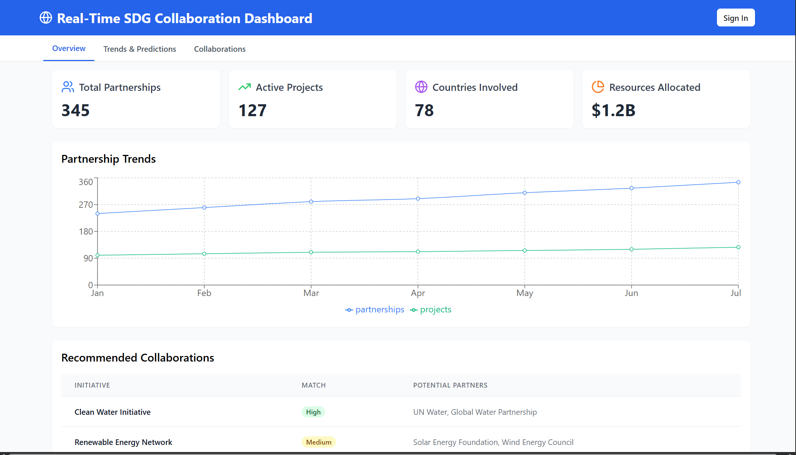

# Real-Time SDG Collaboration Dashboard

## 🌍 Overview
The **Real-Time SDG Collaboration Dashboard** is a web-based platform designed to **track, analyze, and enhance global partnerships** under **Sustainable Development Goal 17 (SDG 17: Partnerships for the Goals)**. The dashboard provides real-time data insights on partnerships, funding allocations, and project impact through **AI-driven analytics and interactive visualizations**.

## 🚀 Key Features
- **Real-Time Data Collection**: Fetches data from sources like **UN SDG API, World Bank, and NGO reports**.
- **AI/ML-Based Predictions**: Uses **LSTM and Prophet models** to analyze trends in partnerships and funding.
- **Interactive Visualizations**: Displays data using **graphs, charts, and maps** for easy interpretation.
- **Collaboration Insights**: AI-driven recommendations for potential partnerships and resource allocation.
- **User-Friendly Interface**: Built using **Dash/Streamlit** for an intuitive experience.

## 📌 Project Roadmap
### **Phase 1: Research & Planning (Week 1)**
- Define objectives and scope.
- Identify stakeholders and data sources.
- Design system architecture and data flow.

### **Phase 2: Backend Development (Week 2)**
- Develop Flask/FastAPI backend.
- Integrate real-time data sources (UN SDG API, World Bank, etc.).
- Set up a database for partnership tracking.

### **Phase 3: AI/ML Implementation (Week 3)**
- Train **LSTM & Prophet models** for trend analysis.
- Implement machine learning algorithms for insights.
- Optimize predictive accuracy.

### **Phase 4: Frontend Development & Visualization (Week 4)**
- Develop a **user-friendly UI using Dash/Streamlit**.
- Implement **interactive visualizations** for real-time insights.
- Connect frontend to backend APIs.

### **Phase 5: Deployment & Future Enhancements**
- Deploy on **AWS/GCP/Heroku**.
- Implement security measures and authentication.
- Gather user feedback and plan enhancements.

## 🛠️ Tech Stack
- **Frontend**: React.js, Dash, Streamlit
- **Backend**: Python, Flask, FastAPI
- **Database**: PostgreSQL/MySQL
- **Machine Learning**: LSTM, Prophet (for trend analysis)
- **APIs**: UN SDG API, World Bank Open Data, NGO Reports
- **Cloud Deployment**: AWS, GCP, Heroku

## 💰 Project Cost
- **Cloud Hosting & Infrastructure**: ~$XX/month (AWS/GCP/Heroku).
- **Domain & SSL Certificate**: ~$XX/year.
- **Development Tools**: Mostly **open-source**, minimal cost.
- **Miscellaneous**: ~$XX for additional resources.

## 📈 Expected Impact
- **Enhanced Decision-Making**: Data-driven insights for global partnerships.
- **Better Resource Allocation**: Optimize funding for SDG projects.
- **Increased Collaboration**: AI-powered recommendations for new partnerships.
- **Greater Transparency**: Clear visibility into SDG 17 initiatives.

## 🔮 Future Enhancements
- Expand data sources to include more **NGO & private sector reports**.
- Improve AI models for more **accurate partnership recommendations**.
- Develop a **mobile version** for broader accessibility.
- Implement **blockchain-based transparency tracking**.

## 📜 License
This project is open-source and available under the **MIT License**.

## 👥 Contributors
- **Wabi Jifara**
- **Selemon Lera**
- **Yodahe Teshome**
- **Yared Zewde**
- **Yeabsira Bekele**

## 🤝 How to Contribute
We welcome contributions! To get started:
1. Fork this repository.
2. Create a new branch (`git checkout -b feature-branch`).
3. Commit your changes (`git commit -m "Added new feature"`).
4. Push to the branch (`git push origin feature-branch`).
5. Open a Pull Request.

## 📞 Contact
For inquiries or collaboration opportunities, please email us at **yaredzbeth@gmail.com**.
